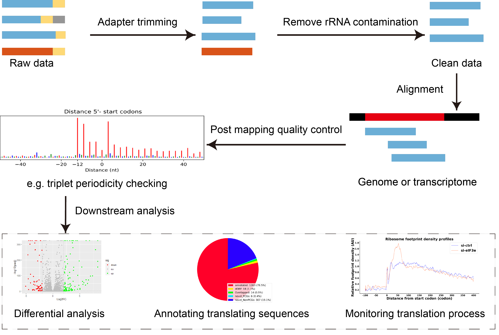

# **Ribosome profiling（Ribo-seq）**
## **Introduction to Ribosome Profiling**
- [Ribosome profiling](https://en.wikipedia.org/wiki/Ribosome_profiling), also known as Ribo-seq, is a commonly used translational sequencing technique developed to monitor translation in vivo on a genome-wide scale. 
- Ribo-seq involves sequencing RNA fragments that are bound to ribosomes during translation, providing accurate information on all translatable molecules in a sample , and enabling precise quantification. It serves as a bridge between the transcriptome and proteome . 
- The basic principle of Ribo-seq is the selective isolation and sequencing of ribosome-protected mRNA fragments, known as ribosome-protected fragments (RPFs). RPFs represent the positions of actively translating ribosomes on the transcriptome.
- More information about ribosome profiling you can read [my review](https://academic.oup.com/bib/article/26/1/bbae641/7922579?login=false).

## **An Overview of Ribosome Profiling Data Analysis**



## **Upstream Workflow of Ribosome Profiling Data**
### **00.rawdata, download**

```
## activate your ribo-seq data analysis environment
conda activate ribo
## download raw date via fastq-dump
nohup fastq-dump --gzip --split-3 --defline-qual '+' --defline-seq '@\$ac-\$si/\$ri'   SRR9047189 &
## check data integrity
cat nohup.out | grep Written
```

### **01.beforeQC, quality control**

```
ls 00.raw/*.gz | xargs fastqc -t 12 -o 01.beforeqc
```

### **02.cutadapt, remove 3' end adapter**

```
workdir=/data-shared/linyy/ribo_GSE114882/02.cutadapt
fastaFile=/data-shared/linyy/ribo_GSE114882/00.raw
adapter=AGATCGGAAGAGCACACGTCT 

for i in SRR7214{386..401}; 
do
        nohup cutadapt -m 20 -M 40 --match-read-wildcards -a $adapter -o $workdir/$i.trimmed.fastq $fastaFile/$i.fastq.gz > $workdir/${i}_trimmed.log &
done
```

### **03.filter, remove reads with low quality**

```
workdir=/data-shared/linyy/ribo_GSE114882/03.filter
fastaFile=/data-shared/linyy/ribo_GSE114882/02.cutadapt

for i in SRR7214{386..401};
do
        nohup fastq_quality_filter -Q33 -v -q 25 -p 75 -i $fastaFile/$i.trimmed.fastq -o $workdir/$i.trimmed.Qfilter.fastq > $workdir/$i.Qfilter.log &
done
```

### **04.afterqc, quality control**

```
ls 03.filter/*.fastq | xargs fastqc -t 12 -o 04.afterqc
```

### **05.contam, remove rRNA contamination**

```
bowtie_noncoding_index=/data-shared/linyy/reference/hg38/rRNA_bowtieIndex/human_rRNA
fastqFile=/data-shared/linyy/ribo_GSE114882/03.filter
workdir=/data-shared/linyy/ribo_GSE114882/05.contam

for i in SRR7214{386..401};
do
      nohup bowtie -n 0 -y -a --norc --best --strata -S -p 1 -l 15 --un=$workdir/noncontam_$i.fastq \
      -x $bowtie_noncoding_index -q $fastqFile/$i.trimmed.Qfilter.fastq $workdir/$i.alin > $i.log 2>&1 &
done
```

### **06.afterQC, quality control**

```
ls 05.contam/*.fastq | xargs fastqc -t 12 -o 06.finalqc
```

### **07.STAR, mapping**

```
STAR_genome_index=/data-shared/linyy/reference/hg38/STAR_Human_Ensembl_hg38_39
workdir=/data-shared/linyy/ribo_GSE114882/07.STAR
fastqFile=/data-shared/linyy/ribo_GSE114882/00.raw

for i in SRR7214{386..401};
do
    mkdir -p $workdir/${i}_STAR
    nohup STAR --outFilterType Normal --outWigNorm RPM --outWigStrand Stranded  \
            --runThreadN 1 --outWigType wiggle  --alignEndsType EndToEnd  \
            --outFilterMismatchNmax 2 --outFilterMultimapNmax 20 \
            --outFilterMatchNmin 15 --outFilterMismatchNoverReadLmax 0.04 \
            --genomeDir $STAR_genome_index \
            --readFilesIn $fastqFile/$i.fastq.gz \
            --outFileNamePrefix  $workdir/${i}_STAR/${i}. \
            --outSAMtype BAM SortedByCoordinate --quantMode TranscriptomeSAM GeneCounts \
            --outSAMattributes All  --limitBAMsortRAM 5838160191 --readFilesCommand zcat &
done

## sort only transcriptome.out.bam
workdir=/data-shared/linyy/ribo_GSE114882/07.STAR

for i in SRR7214{386..401};
do
        nohup samtools sort -T $workdir/${i}_STAR/$i.Aligned.toTranscriptome.out.sorted.bam.temp \
        -o $workdir/${i}_STAR/$i.Aligned.toTranscriptome.out.sorted.bam \
        $workdir/${i}_STAR/$i.Aligned.toTranscriptome.out.bam &
done

## set index
workdir=/data-shared/linyy/ribo_GSE114882/07.STAR

for i in SRR7214{386..401};
do
        nohup samtools index $workdir/${i}_STAR/$i.Aligned.toTranscriptome.out.sorted.bam &
        nohup samtools index $workdir/${i}_STAR/$i.Aligned.sortedByCoord.out.bam &
done

## bam2bigwig
workdir=/data-shared/linyy/ribo_GSE114882/07.STAR

for i in SRR7214{386..401};
do
        nohup bamCoverage -b $workdir/${i}_STAR/$i.Aligned.sortedByCoord.out.bam \
        -o $workdir/${i}_STAR/$i.bw  --normalizeUsing CPM --binSize 1 -p 1 > $workdir/${i}_STAR/$i.bam2bw.log 2>&1 &
done
```

### **08.periodicity, post mapping check**

```
workdir=/data-shared/linyy/ribo_GSE114882/08.periodicity
BamDir=/data-shared/linyy/ribo_GSE114882/07.STAR
RiboCode_annot=/data-shared/linyy/reference/hg38/RiboCode_annot_hg38/RiboCode_annot

for i in SRR7214{386..401};
do
        metaplots -a $RiboCode_annot -r $BamDir/${i}_STAR/$i.Aligned.toTranscriptome.out.sorted.bam -o $workdir/$i -m 20 -M 40
done
```

### **09.ReadLengthDistribution, post mapping check**

```
workdir=/data-shared/linyy/ribo_GSE114882/09.ReadLengthDistribution
BamDir=/data-shared/linyy/ribo_GSE114882/07.STAR

for i in SRR7214{386..401};
do
        nohup LengthDistribution -i $BamDir/${i}_STAR/$i.Aligned.toTranscriptome.out.sorted.bam -o $workdir/$i -f bam > $workdir/$i_reads_length.log 2>&1 &
done
```

### **10.read count**

```
BamDir=/data-shared/linyy/ribo_GSE114882/07.STAR
workdir=/data-shared/linyy/ribo_GSE114882/10.read_counts

for i in SRR7214{386..401};
do
        nohup ModifyHTseq -i $BamDir/${i}_STAR/$i.Aligned.sortedByCoord.out.bam \
        -g /data-shared/linyy/reference/hg38/ensembl/Homo_sapiens.GRCh38.109.chr.gtf \
        -o $workdir/$i.counts \
        -m union -q 10 --minLen 25 --maxLen 35 --exclude-first 45 --exclude-last 15 \
        -t CDS --id-type gene_name > $workdir/$i.counts.log 2>&1 &
done
```

### **11.RPF statistics**

```
BamDir=/data-shared/linyy/ribo_GSE114882/07.STAR
workdir=/data-shared/linyy/ribo_GSE114882/11.RPF_statistics

for i in SRR7214{386..401};
do
        nohup StatisticReadsOnDNAsContam -i $BamDir/${i}_STAR/$i.Aligned.sortedByCoord.out.bam \
        -g /data-shared/linyy/reference/hg38/ensembl/Homo_sapiens.GRCh38.109.chr.gtf \
        -o $workdir/$i > $workdir/$i.statistics.log 2>&1 &
done
```